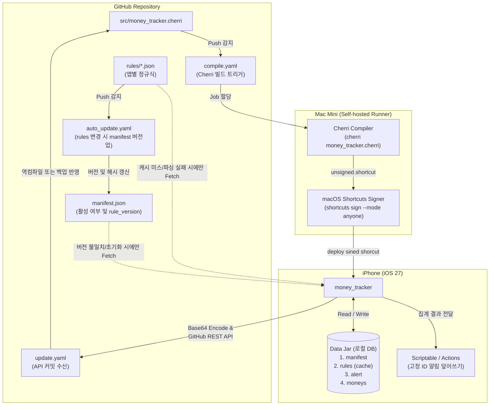

```mermaid
graph TB
    subgraph GitHub ["GitHub Repository"]
        SRC["src/money_tracker.cherri"]
        RULES["rules/*.json<br/>(앱별 정규식)"]
        MANIFEST["manifest.json<br/>(활성 여부 및 rule_version)"]
        
        WF_AUTO["auto_update.yaml<br/>(rules 변경 시 manifest 버전업)"]
        WF_COMP["compile.yaml<br/>(Cherri 빌드 트리거)"]
        WF_UPD["update.yaml<br/>(API 커밋 수신)"]
        
        RULES -->|Push 감지| WF_AUTO
        WF_AUTO -->|버전 및 해시 갱신| MANIFEST
        SRC -->|Push 감지| WF_COMP
    end

    subgraph Runner ["Mac Mini (Self-hosted Runner)"]
        CHERRI["Cherri Compiler<br/>(cherri money_tracker.cherri)"]
        SIGN["macOS Shortcuts Signer<br/>(shortcuts sign --mode anyone)"]
        
        WF_COMP -->|Job 할당| CHERRI
        CHERRI -->|unsigned.shortcut| SIGN
    end

    subgraph iOS ["iPhone (iOS 27)"]
        SHORTCUT["money_tracker"]
        DATAJAR[("Data Jar (로컬 DB)<br/>1. manifest<br/>2. rules (cache)<br/>3. alert<br/>4. moneys")]
        SCRIPTABLE["Scriptable / Actions<br/>(고정 ID 알림 덮어쓰기)"]
        
        SIGN -->|deploy sined shorcut| SHORTCUT
        SHORTCUT <-->|Read / Write| DATAJAR
        SHORTCUT -->|집계 결과 전달| SCRIPTABLE
        SHORTCUT -->|Base64 Encode &<br/>GitHub REST API | WF_UPD
        WF_UPD -->|역컴파일 또는 백업 반영| SRC
    end

    MANIFEST -.->|버전 불일치/초기화 시에만 Fetch| SHORTCUT
    RULES -.->|캐시 미스/파싱 실패 시에만 Fetch| SHORTCUT
```
